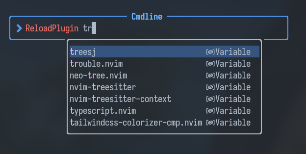

# lazy-reload.nvim

A small utility for lazy.nvim to easily reload a plugin.


note: Not all plugins can be reloaded this way, read more about it [https://github.com/folke/lazy.nvim/issues/445](here). 

---

## Example



---

## Installaton

Install the plugin with your preffered package manager:

### lazy.nvim

```lua
...
return {
 "MaximilianLloyd/lazy-reload.nvim",
 opts = {
  -- your configuration comes here
  -- or leave it empty to use the default settings
  -- refer to the configuration section below
 },
keys = {
-- Opens the command. 
    { "<leader>rl", "<cmd>lua require('lazy-reload').feed()<cr>", desc = "Reload a plugin" },
  }
}

...

```

### Configuration

Not much to see here, but you can modify the command name.

```lua
{
	command_name = "ReloadPlugin"
}
```

### Running

It can be run by using `ReloadPlugin <plugin name>`.
